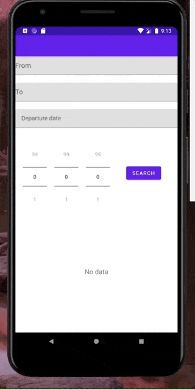

# FlightHelp

**A simple app using ryanair api**

Api link https://www.ryanair.com/api/booking/v4

DONE:
* Basic version: fetching albums, album info, artist info
* Uses:
    * MVI
    * RecyclerView
    * Retrofit
    * Coroutines

TODO:
* Better layouts / UI
* State is not yet saved on rotations
* UnitTests

